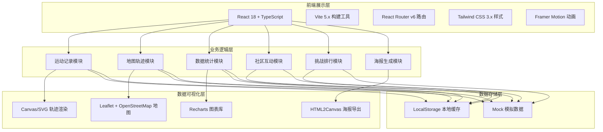
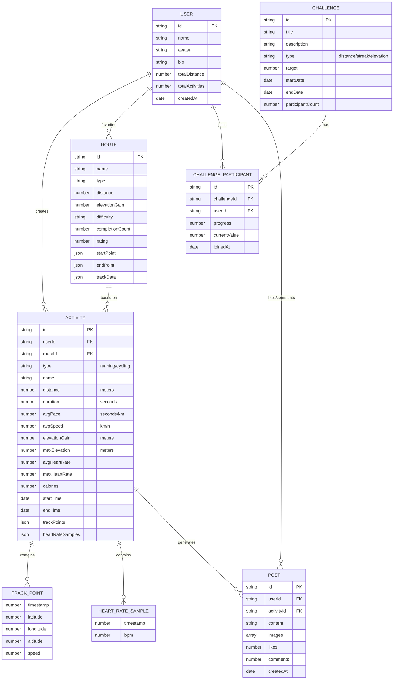

# 跑步骑行轨迹记录与分享平台 - 技术架构文档

## 1. 架构设计



## 2. 技术栈说明

- **前端框架**：React@18 + TypeScript@5 - 类型安全的组件化开发
- **构建工具**：Vite@5 - 极速开发体验，HMR 热更新
- **路由管理**：react-router-dom@6 - 声明式路由，代码分割
- **样式方案**：Tailwind CSS@3 + PostCSS - 原子化CSS，自定义主题
- **动画库**：framer-motion@11 - 流畅的交互动画和页面过渡
- **地图服务**：leaflet@1.9 + react-leaflet@4 - 开源地图SDK，OSM瓦片
- **图表库**：recharts@2 - 基于SVG的React图表组件
- **海报生成**：html2canvas@1.4 - DOM转图片，海报导出
- **图标库**：lucide-react@0.408 - 现代线性图标库
- **状态管理**：React Context + useReducer - 轻量级全局状态
- **工具库**：date-fns（日期处理）、geolib（地理计算）

## 3. 路由定义

| 路由路径 | 页面组件 | 功能说明 |
|---------|---------|---------|
| `/` | `Dashboard` | 首页仪表盘 - 数据概览、快速记录、推荐路线 |
| `/record` | `RecordActivity` | 运动记录页 - 实时GPS轨迹、运动控制 |
| `/activity/:id` | `ActivityDetail` | 运动详情页 - 轨迹地图、数据分析图表 |
| `/profile` | `Profile` | 个人中心 - 历史记录、统计、PB成绩墙 |
| `/routes` | `RouteExplorer` | 路线探索 - 路线地图、筛选、跑这条路线 |
| `/community` | `Community` | 社区广场 - 动态流、互动评论、热门话题 |
| `/challenges` | `Challenges` | 挑战活动 - 挑战列表、排行榜、进度追踪 |
| `/share/:id` | `SharePoster` | 分享海报 - 模板选择、自定义、导出 |

## 4. 数据模型定义

### 4.1 实体关系图



### 4.2 TypeScript 类型定义

```typescript
// 用户类型
interface User {
  id: string;
  name: string;
  avatar: string;
  bio: string;
  totalDistance: number;
  totalActivities: number;
  createdAt: string;
}

// 运动类型
type ActivityType = 'running' | 'cycling';

// 轨迹点
interface TrackPoint {
  timestamp: number;
  latitude: number;
  longitude: number;
  altitude: number;
  speed: number;
}

// 心率采样
interface HeartRateSample {
  timestamp: number;
  bpm: number;
}

// 运动记录
interface Activity {
  id: string;
  userId: string;
  routeId?: string;
  type: ActivityType;
  name: string;
  distance: number;
  duration: number;
  avgPace: number;
  avgSpeed: number;
  elevationGain: number;
  maxElevation: number;
  avgHeartRate?: number;
  maxHeartRate?: number;
  calories: number;
  startTime: string;
  endTime: string;
  trackPoints: TrackPoint[];
  heartRateSamples?: HeartRateSample[];
  splits?: SplitRecord[];
}

// 分段记录
interface SplitRecord {
  index: number;
  distance: number;
  duration: number;
  pace: number;
  elevationGain: number;
}

// 路线
interface Route {
  id: string;
  name: string;
  type: ActivityType;
  distance: number;
  elevationGain: number;
  difficulty: 'easy' | 'moderate' | 'hard';
  completionCount: number;
  rating: number;
  startPoint: [number, number];
  endPoint: [number, number];
  trackData: TrackPoint[];
  isFavorite?: boolean;
}

// 挑战类型
type ChallengeType = 'distance' | 'streak' | 'elevation';

// 挑战
interface Challenge {
  id: string;
  title: string;
  description: string;
  type: ChallengeType;
  target: number;
  unit: string;
  startDate: string;
  endDate: string;
  participantCount: number;
  participants: ChallengeParticipant[];
  banner?: string;
}

// 挑战参与者
interface ChallengeParticipant {
  userId: string;
  user: User;
  progress: number;
  currentValue: number;
  joinedAt: string;
  rank?: number;
}

// 社区动态
interface Post {
  id: string;
  userId: string;
  user: User;
  activityId?: string;
  content: string;
  images: string[];
  likes: number;
  comments: Comment[];
  createdAt: string;
  isLiked?: boolean;
}

// 评论
interface Comment {
  id: string;
  userId: string;
  user: User;
  content: string;
  createdAt: string;
}

// 成就徽章
interface Badge {
  id: string;
  name: string;
  description: string;
  icon: string;
  unlocked: boolean;
  unlockedAt?: string;
  category: 'milestone' | 'streak' | 'challenge' | 'explorer';
}

// PB记录
interface PersonalBest {
  distance: string;
  value: string;
  date: string;
  activityId: string;
  isNew?: boolean;
}
```

## 5. 核心算法与工具

### 5.1 地理计算

- **距离计算**：使用 Haversine 公式计算两个经纬度点之间的球面距离
- **配速计算**：`pace = duration / distance`（秒/公里）
- **海拔变化**：遍历轨迹点计算累计上升/下降高度
- **轨迹简化**：使用 Douglas-Peucker 算法简化轨迹点，减少渲染开销

### 5.2 数据聚合

- **月度统计**：按日历月聚合运动数据，计算里程、时长、次数
- **配速分段**：每公里自动分段，记录分段配速和海拔变化
- **心率区间**：根据最大心率百分比划分为5个区间（热身/燃脂/有氧/无氧/极限）

## 6. 前端项目结构

```
src/
├── components/          # 通用组件
│   ├── layout/         # 布局组件（导航、侧边栏、页脚）
│   ├── maps/           # 地图相关组件
│   ├── charts/         # 图表组件
│   ├── cards/          # 卡片组件
│   ├── forms/          # 表单组件
│   └── ui/             # 基础UI组件
├── pages/              # 页面组件
│   ├── Dashboard.tsx
│   ├── RecordActivity.tsx
│   ├── ActivityDetail.tsx
│   ├── Profile.tsx
│   ├── RouteExplorer.tsx
│   ├── Community.tsx
│   ├── Challenges.tsx
│   └── SharePoster.tsx
├── context/            # React Context 状态管理
│   ├── AuthContext.tsx
│   ├── ActivityContext.tsx
│   └── ThemeContext.tsx
├── data/               # Mock 数据
│   ├── mockActivities.ts
│   ├── mockRoutes.ts
│   ├── mockChallenges.ts
│   ├── mockPosts.ts
│   └── mockUser.ts
├── hooks/              # 自定义 Hooks
│   ├── useGPS.ts
│   ├── useTimer.ts
│   ├── useActivityStats.ts
│   └── useGeoCalculations.ts
├── utils/              # 工具函数
│   ├── formatters.ts   # 时间/距离/配速格式化
│   ├── geoCalculations.ts  # 地理计算
│   ├── colors.ts       # 颜色/配速区间映射
│   └── exportPoster.ts # 海报导出
├── types/              # TypeScript 类型定义
│   └── index.ts
├── styles/             # 全局样式和Tailwind配置
│   └── globals.css
├── App.tsx
├── main.tsx
└── router.tsx          # 路由配置
```
