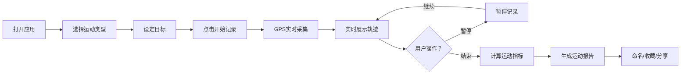
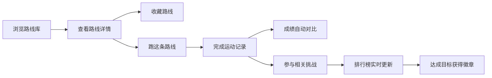

# 跑步骑行轨迹记录与分享平台 - 产品需求文档

## 1. 产品概述

TrackPath 是一款专注于跑步和骑行运动轨迹记录与分享的Web平台。与通用健康追踪应用不同，TrackPath 深度聚焦于运动轨迹、路线探索和社区互动，为运动爱好者提供专业的轨迹记录、路线分享、成绩对比和挑战活动服务。

- **核心价值**：让每一次运动留下精确的轨迹印记，让每条优质路线被更多人发现和挑战
- **目标用户**：跑步爱好者、骑行爱好者、马拉松训练者、户外运动社群
- **差异化**：极致的轨迹可视化体验、路线复用与成绩对比、社区挑战排行榜、精美分享海报

## 2. 核心功能

### 2.1 用户角色

| 角色 | 注册方式 | 核心权限 |
|------|---------|---------|
| 普通用户 | 邮箱/手机号注册 | 记录运动、浏览路线、参与挑战、分享内容 |
| 社区达人 | 累计发布10+优质路线 | 创建挑战、推荐路线、社区认证标识 |

### 2.2 功能模块

1. **首页仪表盘**：运动概览、快速开始记录、推荐路线、社区动态
2. **运动记录页**：实时GPS轨迹记录、运动暂停/继续、运动中数据展示
3. **运动详情页**：轨迹地图展示、配速/海拔/心率图表、分段成绩分析
4. **个人中心页**：历史记录筛选、月度统计、PB成绩墙、成就徽章
5. **路线探索页**：热门路线地图、路线收藏、筛选搜索、"跑这条路线"
6. **社区广场页**：用户动态流、路线分享、互动点赞评论
7. **挑战活动页**：进行中挑战、排行榜、个人进度、创建挑战
8. **分享海报页**：运动总结海报生成、自定义样式、一键分享

### 2.3 页面详情

| 页面名称 | 模块名称 | 功能描述 |
|---------|---------|---------|
| 首页仪表盘 | 数据概览卡片 | 展示本周里程、运动次数、累计时长、今日目标进度 |
| 首页仪表盘 | 快速记录入口 | 运动类型选择（跑步/骑行）、开始按钮、目标设定 |
| 首页仪表盘 | 推荐路线 | 附近热门路线、收藏路线、个性化推荐卡片 |
| 首页仪表盘 | 社区动态 | 最新完成的运动、挑战里程碑、好友动态 |
| 运动记录页 | 实时地图 | GPS实时轨迹绘制、当前位置高亮、路线缩放 |
| 运动记录页 | 实时数据面板 | 距离、配速、时长、卡路里、海拔实时刷新 |
| 运动记录页 | 控制按钮 | 开始/暂停/继续/结束，锁定屏幕防误触 |
| 运动记录页 | 心率区间展示 | 手表导入心率数据实时显示区间分布 |
| 运动详情页 | 轨迹全景地图 | 完整路线叠加地图、起终点标记、分段配速色带 |
| 运动详情页 | 数据统计卡片 | 总距离、总时长、平均配速、最高海拔、累计爬升 |
| 运动详情页 | 配速图表 | 公里分段配速柱状图、配速趋势折线图 |
| 运动详情页 | 海拔剖面 | 海拔变化折线图、爬升/下降统计标注 |
| 运动详情页 | 心率分析 | 心率曲线图、区间分布饼图、平均/最大心率 |
| 运动详情页 | 操作区 | 收藏路线、分享、重新挑战、生成海报 |
| 个人中心页 | 时间筛选 | 周/月/年/自定义时间段切换 |
| 个人中心页 | 统计图表 | 月度里程趋势图、运动类型占比饼图 |
| 个人中心页 | 历史记录列表 | 按时间/距离/类型筛选、缩略轨迹预览 |
| 个人中心页 | PB成绩墙 | 5K/10K/半马/全马最佳成绩、骑行距离记录 |
| 个人中心页 | 成就徽章 | 里程碑徽章、连续打卡、挑战完成勋章 |
| 路线探索页 | 地图视图 | 周边路线热力图、路线筛选标签 |
| 路线探索页 | 路线列表 | 卡片式展示，包含距离、难度、完成人数、评分 |
| 路线探索页 | 路线详情弹窗 | 预览轨迹、海拔概况、最近活动、收藏按钮 |
| 路线探索页 | "跑这条路线" | 一键加载路线开始导航记录 |
| 社区广场页 | 动态流 | 用户分享的运动记录瀑布流、图片预览 |
| 社区广场页 | 互动功能 | 点赞、评论、转发、关注用户 |
| 社区广场页 | 推荐标签 | 热门话题、精选路线、本周之星 |
| 挑战活动页 | 挑战列表 | 进行中/即将开始/已完成挑战分类展示 |
| 挑战活动页 | 挑战详情 | 规则说明、参与人数、进度条、倒计时 |
| 挑战活动页 | 实时排行榜 | 参与者排名、头像、进度、距离/时长对比 |
| 分享海报页 | 模板选择 | 多种精美海报模板（简约/动感/风景/数据型） |
| 分享海报页 | 数据编辑 | 自定义文案、添加照片、调整配色主题 |
| 分享海报页 | 预览导出 | 高清图片预览、下载保存、社交平台分享 |

## 3. 核心流程

### 3.1 运动记录流程

用户打开应用 → 选择运动类型（跑步/骑行） → 设定目标（可选）→ 点击开始记录 → GPS实时采集位置数据 → 实时展示轨迹和运动数据 → 用户可暂停/继续 → 用户点击结束 → 自动计算各项指标 → 生成完整运动报告 → 用户可命名、收藏、分享

### 3.2 路线探索与挑战流程

浏览路线 → 查看路线详情 → 收藏或"跑这条路线" → 完成运动 → 成绩与路线绑定 → 参与挑战活动 → 排行榜实时更新 → 达成目标获得徽章

## 4. 用户界面设计

### 4.1 设计风格

**设计主题：动感活力 × 专业数据**

- **主色调**：渐变橙红（#FF6B35 → #F7931E）- 代表运动激情与活力
- **辅助色**：深青绿（#0D9488）- 代表自然与健康，用于强调和图表
- **中性色**：炭黑（#1A1A2E）、石板灰（#4A5568）、云白（#FAFAFA）
- **点缀色**：电光蓝（#3B82F6）用于导航和互动元素

**设计元素：**
- **按钮风格**：圆角胶囊型（12px），主按钮带渐变和微投影，悬停时放大1.02倍
- **字体**：标题使用 Display 字体（Space Grotesk / Outfit），正文使用现代无衬线（Plus Jakarta Sans）
- **布局风格**：卡片式栅格布局，大量留白，对角线视觉引导，数据卡片叠加玻璃态效果
- **图标风格**：线性与填充混合，动态图标配合微交互（如脉冲的开始按钮）
- **视觉特效**：渐变描边卡片、轨迹发光效果、数据徽章悬浮动画、滚动触发渐入

### 4.2 页面设计概览

| 页面名称 | 模块名称 | UI 设计要点 |
|---------|---------|------------|
| 首页仪表盘 | 数据概览卡片 | 玻璃态卡片叠加渐变背景，数据数字大号加粗，趋势小图嵌入 |
| 首页仪表盘 | 快速记录入口 | 超大圆形渐变按钮，脉冲呼吸动画，周围环绕运动类型选择 |
| 首页仪表盘 | 推荐路线 | 横向滚动卡片，小地图缩略图叠加，距离/爬升标签悬浮 |
| 运动记录页 | 实时地图 | 全屏地图，轨迹线条渐变发光，当前位置蓝色脉冲点 |
| 运动记录页 | 实时数据面板 | 底部半透明磨砂面板，大数据卡片横向排列，关键指标高亮 |
| 运动详情页 | 轨迹全景地图 | 大尺寸地图卡片，配速热力色带，起终点旗帜图标 |
| 运动详情页 | 配速/海拔图表 | 圆角大图表，渐变填充面积图，鼠标悬浮显示详情 tooltip |
| 个人中心页 | PB成绩墙 | 金色渐变卡片，奖杯图标，破纪录显示闪烁效果 |
| 挑战活动页 | 排行榜 | 前三名金银铜渐变背景，头像带光环，进度条带动画填充 |
| 分享海报页 | 模板选择 | 卡片悬浮 3D 翻转效果，模板缩略图真实数据预览 |

### 4.3 响应式设计

- **设计策略**：桌面端优先，移动端完美适配
- **断点设置**：
  - 桌面端：≥1280px，三栏布局（导航+主内容+侧边栏）
  - 平板端：768px-1279px，两栏布局（折叠导航+主内容）
  - 移动端：<768px，单栏布局，底部Tab导航，大触控区域
- **触控优化**：移动端按钮最小高度48px，手势滑动切换图表，地图双指缩放

### 4.4 运动轨迹可视化（核心亮点）

- **轨迹配色**：按配速分段着色（快→绿色，慢→红色），形成直观的配速热力图
- **海拔叠加**：3D 视角切换时，轨迹可沿海拔抬升形成立体路线
- **动态回放**：支持按时间轴回放运动过程，小人图标沿轨迹移动
- **对比模式**：同一路线多次运动轨迹半透明叠加，直观对比成绩差异
